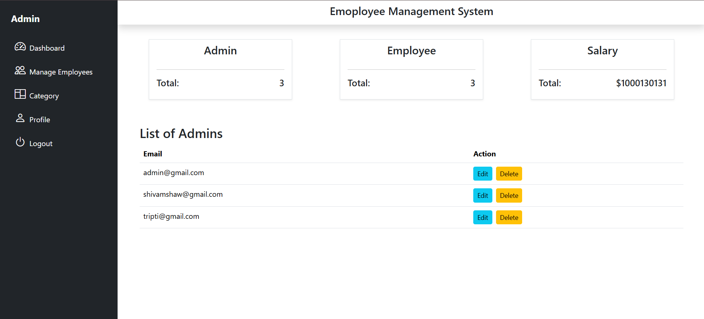
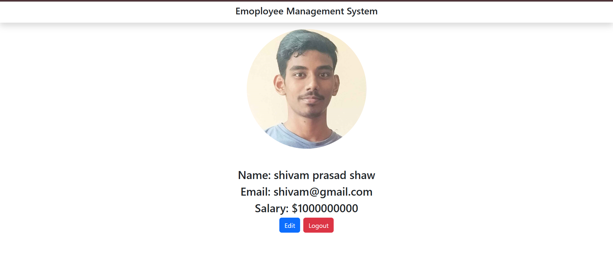
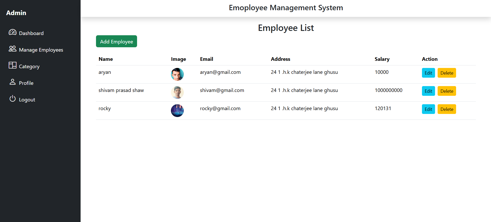

# 👥 Employee Management System (EMS) — MERN Stack

A full-stack **Employee Management System** built with the **MERN stack** (MongoDB, Express.js, React.js, Node.js), featuring **role-based authentication** for Admin and Employee users. This software enables efficient HR operations like managing departments, employee records, and leave tracking.

---

##  Features

### 👤 Role-Based Access
- **Admin**
  - Add/manage employees
  - Add/remove departments
  - Approve/reject leave applications
  - View all employee data

- **Employee**
  - View and update profile
  - Apply for leave
  - View leave status
  - Access department information

---

## 🏗️ Tech Stack

| Tech        | Purpose                        |
|-------------|--------------------------------|
| MongoDB     | Database (NoSQL)               |
| Express.js  | Backend framework (Node.js)    |
| React.js    | Frontend (SPA)                 |
| Node.js     | Backend runtime                |
| JWT         | Role-based authentication      |
| Tailwind CSS| UI styling                     |

---

## 📁 Project Structure

    employee-management-system/
    ├── backend/
    │ ├── models/
    │ ├── routes/
    │ ├── controllers/
    │ ├── middleware/
    │ ├── config/
    │ └── server.js
    ├── frontend/
    │ ├── src/
    │ │ ├── components/
    │ │ ├── pages/
    │ │ ├── context/
    │ │ └── App.jsx
    │ └── tailwind.config.js
    ├── .env
    ├── README.md
    └── package.json

---

## 🔐 Authentication & Authorization

- Uses **JWT (JSON Web Tokens)** for secure token-based login
- Middleware ensures **protected routes** for Admin vs Employee
- Passwords hashed with **bcrypt**

---

## 📸 Screenshots

### 🖥️ Admin Dashboard

### 📋 Employee View

### 🗂️ Manage Departments

---

## ⚙️ Installation

1. **Clone the repository**

       git clone https://github.com/yourusername/employee-management-system.git
       cd employee-management-system
2. Setup backend
   
       cd backend
       npm install
       node index.js
3.Setup frontend

       cd ../frontend
       npm install
       npm run dev
4.Configure environment

        Create a .env file in /backend:
        PORT=5000
        MONGO_URI=your_mongodb_connection_string
        JWT_SECRET=your_jwt_secret

🧪 Future Improvements

    ✅ Email notifications for leave updates
    
    ✅ Department-based role hierarchies
    
    📊 Attendance tracking system
    
    📁 Downloadable employee reports

